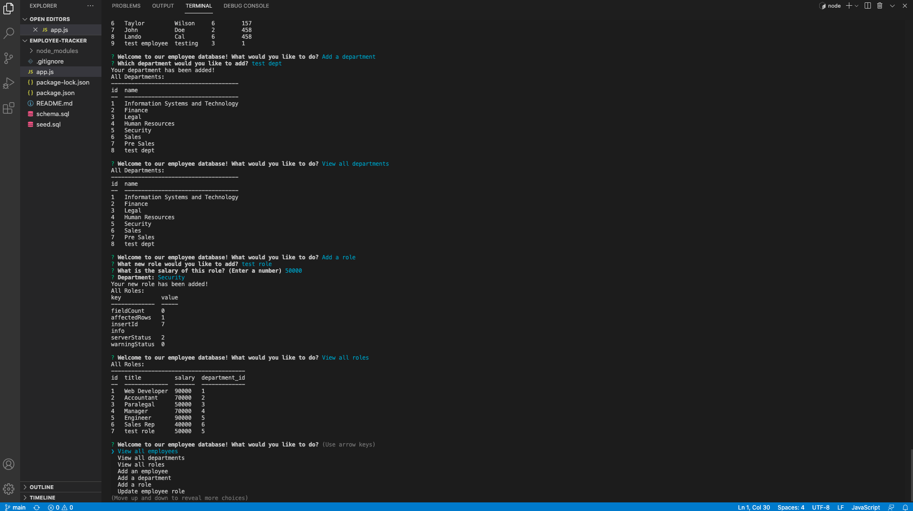

# employee-tracker
## Description
A node.js application that uses user input from inquirer to populate an employee tracker database displaying members of a company.

## Functionality
1. Use the CLI interface to select employee management options
2. Menu options lead to additional prompts
3. Options return to the home menu.
4. Select the next option as needed.
5. Use the Exit option to close the application.

## Built With

* [NPM](https://www.npmjs.com)
* [JavaScript](https://developer.mozilla.org/en-US/docs/Web/JavaScript)
* [HTML](https://developer.mozilla.org/en-US/docs/Web/HTML)
* [CSS](https://developer.mozilla.org/en-US/docs/Web/CSS)

## Authors

* **Trevor Coons** 

- [Link to Portfolio Site](https://trevcoons.github.io/trevors-portfolio/)
- [Link to Github](https://github.com/trevcoons)
- [Link to LinkedIn](www.linkedin.com/in/trevor-coons-2a948a104)

## Acknowledgments

Thanks to UC Berkeley Coding Bootcamp for teaching me JavaScript and NPM.